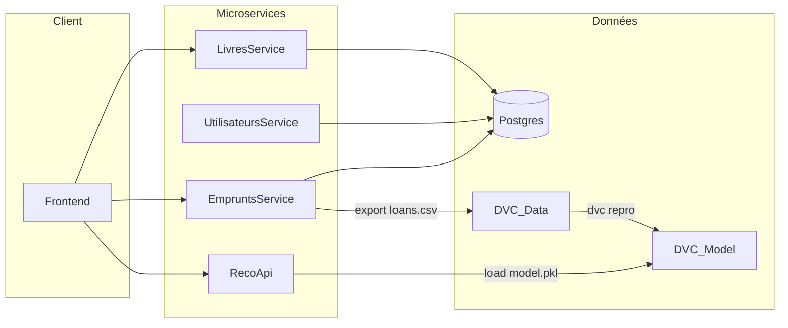

# Architecture (vue d'ensemble)

## Services (cible)

```mermaid
flowchart LR
  subgraph client [Client]
    Frontend[Frontend]
  end

  subgraph services [Microservices]
    LivresService[LivresService]
    UtilisateursService[UtilisateursService]
    EmpruntsService[EmpruntsService]
    RecoApi[RecoApi]
  end

  subgraph dataLayer [Données]
    Postgres[(Postgres)]
    DvcData[DVC_Data]
    DvcModel[DVC_Model]
  end

  Frontend --> LivresService
  Frontend --> EmpruntsService
  Frontend --> RecoApi

  LivresService --> Postgres
  UtilisateursService --> Postgres
  EmpruntsService --> Postgres

  EmpruntsService -->|"export loans.csv"| DvcData
  DvcData -->|"dvc repro"| DvcModel
  RecoApi -->|"load model.pkl"| DvcModel
```

## Notes

- Communication entre services via REST (examen).\n- DVC versionne dataset + modèle.\n- Jenkins orchestre build/test/smoke/DVC.\n
